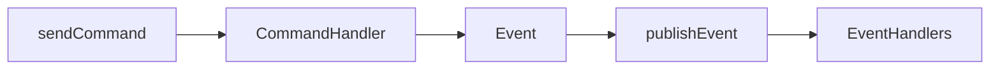

# @xolvio/message-bus

Type-safe message bus implementing the CQRS pattern with command handling and event publishing.

---

## Purpose

Without `@xolvio/message-bus`, you would have to implement your own command/event routing, handle handler registration, manage request/correlation ID propagation, and ensure proper error isolation between handlers.

This package provides the core messaging infrastructure for the Auto Engineer ecosystem. It enables decoupled communication through commands (write operations) and events (state changes) with robust debugging support.

---

## Installation

```bash
pnpm add @xolvio/message-bus
```

## Quick Start

```typescript
import { createMessageBus, defineCommandHandler } from '@xolvio/message-bus';

const bus = createMessageBus();

const handler = defineCommandHandler({
  name: 'CreateUser',
  alias: 'create-user',
  description: 'Creates a new user',
  fields: {
    name: { description: 'User name', required: true },
  },
  examples: [],
  events: ['UserCreated'],
  handle: async (cmd) => ({
    type: 'UserCreated',
    data: { userId: 'u-001', name: cmd.data.name },
  }),
});

bus.registerCommandHandler(handler);

const result = await bus.sendCommand({
  type: 'CreateUser',
  data: { name: 'John' },
});

console.log(result);
// → { type: 'UserCreated', data: { userId: 'u-001', name: 'John' } }
```

---

## How-to Guides

### Register a Command Handler

```typescript
import { createMessageBus, defineCommandHandler } from '@xolvio/message-bus';

const handler = defineCommandHandler({
  name: 'MyCommand',
  alias: 'my-command',
  description: 'Does something',
  fields: {},
  examples: [],
  events: ['MyEvent'],
  handle: async (cmd) => ({ type: 'MyEvent', data: {} }),
});

const bus = createMessageBus();
bus.registerCommandHandler(handler);
```

### Send a Command

```typescript
const result = await bus.sendCommand({
  type: 'CreateUser',
  data: { name: 'John', email: 'john@example.com' },
  requestId: 'req-123',
});
```

### Subscribe to Events

```typescript
const subscription = bus.subscribeToEvent('UserCreated', {
  name: 'UserCreatedNotifier',
  handle: async (event) => {
    console.log(`User created: ${event.data.userId}`);
  },
});

subscription.unsubscribe();
```

### Subscribe to All Events

```typescript
const subscription = bus.subscribeAll({
  name: 'EventLogger',
  handle: (event) => {
    console.log(`[${event.type}]`, event.data);
  },
});
```

### Return Multiple Events

```typescript
const handler = defineCommandHandler({
  name: 'BatchCreate',
  // ...
  handle: async (cmd) => {
    return cmd.data.items.map(item => ({
      type: 'ItemCreated',
      data: item,
    }));
  },
});
```

---

## API Reference

### Package Exports

```typescript
import {
  createMessageBus,
  defineCommandHandler,
} from '@xolvio/message-bus';

import type {
  Command,
  Event,
  CommandHandler,
  EventHandler,
  EventSubscription,
  MessageBus,
  UnifiedCommandHandler,
  FieldDefinition,
} from '@xolvio/message-bus';
```

### Functions

#### `createMessageBus(): MessageBus`

Create a new message bus instance.

#### `defineCommandHandler(options): UnifiedCommandHandler`

Define a command handler with CLI metadata.

### Command Type

```typescript
type Command<Type extends string, Data> = Readonly<{
  type: Type;
  data: Readonly<Data>;
  timestamp?: Date;
  requestId?: string;
  correlationId?: string;
}>;
```

### Event Type

```typescript
type Event<Type extends string, Data> = Readonly<{
  type: Type;
  data: Data;
  timestamp?: Date;
  requestId?: string;
  correlationId?: string;
}>;
```

### MessageBus Interface

```typescript
interface MessageBus {
  registerCommandHandler(handler: CommandHandler): void;
  registerEventHandler(eventType: string, handler: EventHandler): void;
  sendCommand(command: Command): Promise<Event | Event[]>;
  publishEvent(event: Event): Promise<void>;
  subscribeToEvent(eventType: string, handler: EventHandler): EventSubscription;
  subscribeAll(handler: EventHandler): EventSubscription;
  getCommandHandlers(): Record<string, CommandHandler>;
}
```

---

## Architecture

```
src/
├── index.ts
├── message-bus.ts
├── define-command.ts
└── types.ts
```

The following diagram shows the message flow:



*Flow: Command is sent, handler processes it, returns event(s), events are published to subscribers.*

### Key Concepts

- **One handler per command type**: Ensures deterministic command processing
- **Multiple handlers per event type**: Enables fan-out notification
- **Request/Correlation ID propagation**: Maintains traceability
- **Error isolation**: Handler failures don't affect other handlers

### Dependencies

This package has no dependencies on other `@xolvio/*` packages. It is a foundational package used throughout the monorepo.
