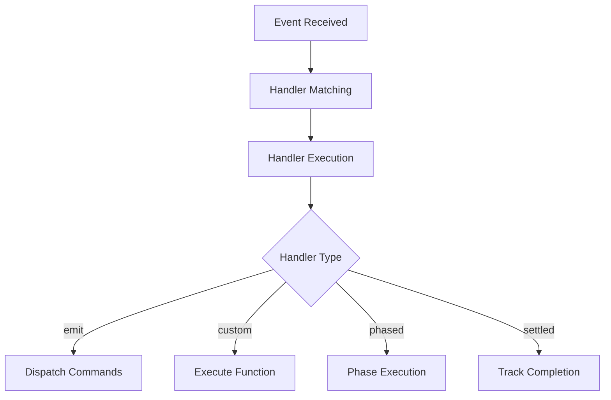

# @xolvio/pipeline

Event-driven SDLC pipeline orchestration system with declarative workflow definitions.

---

## Purpose

Without `@xolvio/pipeline`, you would have to manually wire event handlers, coordinate phased execution, track command completion across correlations, and implement your own SSE streaming for real-time monitoring.

This package provides the core infrastructure for building event-sourced pipelines. It enables declarative workflow definitions using a fluent builder API, reactive event handling, phased execution, settled handlers, and real-time monitoring via SSE.

---

## Installation

```bash
pnpm add @xolvio/pipeline
```

## Quick Start

```typescript
import { define, PipelineServer } from '@xolvio/pipeline';

const pipeline = define('SDLC')
  .on('CodePushed')
  .emit('AnalyzeCode', (e) => ({ filePath: e.data.path }))

  .on('CodeAnalyzed')
  .emit('Deploy', { version: '1.0.0' })

  .build();

const server = new PipelineServer({ port: 3000 });
server.registerPipeline(pipeline);

await server.start();
console.log(`Server running at http://localhost:${server.port}`);
```

---

## Key Concepts

- **Events**: Immutable facts that have occurred
- **Commands**: Intentions to perform actions
- **Handlers**: React to events by dispatching commands
- **Pipelines**: Declarative workflows connecting events to commands

---

## How-to Guides

### Define a Simple Pipeline

```typescript
import { define } from '@xolvio/pipeline';

const pipeline = define('my-pipeline')
  .on('TriggerEvent')
  .emit('OutputCommand', { data: 'value' })
  .build();
```

### Use Conditional Handlers

```typescript
const pipeline = define('conditional')
  .on('CodeAnalyzed')
  .when((e) => e.data.issues.length === 0)
  .emit('Deploy', {})
  .build();
```

### Use Custom Handlers

```typescript
const pipeline = define('custom')
  .on('SpecialEvent')
  .handle(async (event, ctx) => {
    await ctx.emit('NotifyUser', { message: 'Processing complete' });
  })
  .build();
```

### Use Phased Execution

```typescript
const pipeline = define('builder')
  .on('ComponentsReady')
  .forEach((e) => e.data.components)
  .groupInto(['critical', 'normal'], (c) => c.priority)
  .process('ProcessComponent', (c) => ({ path: c.path }))
  .stopOnFailure()
  .onComplete({
    success: 'AllComplete',
    failure: 'ProcessingFailed',
    itemKey: (e) => e.data.path,
  })
  .build();
```

### Use Settled Handlers

```typescript
const pipeline = define('aggregator')
  .settled(['TaskA', 'TaskB', 'TaskC'])
  .dispatch({ dispatches: ['FinalizeProcess'] }, (events, send) => {
    send('FinalizeProcess', { combined: Object.values(events).flat() });
  })
  .build();
```

### Start the Pipeline Server

```typescript
import { PipelineServer } from '@xolvio/pipeline';

const server = new PipelineServer({ port: 3000 });
server.registerCommandHandlers([handler1, handler2]);
server.registerPipeline(pipeline);

await server.start();
```

### Consume SSE Events

```typescript
const url = new URL('/events', 'http://localhost:5555');
url.searchParams.set('correlationId', 'corr-123'); // optional filter

const eventSource = new EventSource(url.toString());
eventSource.onmessage = (msg) => {
  const event = JSON.parse(msg.data);
  console.log(event.type, event.data);
};
```

### Handle SSE Reconnection

```typescript
function connectWithRetry(url: string, maxRetries = 5) {
  let retries = 0;
  function connect() {
    const es = new EventSource(url);
    es.onopen = () => { retries = 0; };
    es.onerror = () => {
      es.close();
      if (retries++ < maxRetries) setTimeout(connect, 3000);
    };
    return es;
  }
  return connect();
}
```

---

## API Reference

### Package Exports

```typescript
import {
  define,
  dispatch,
  PipelineRuntime,
  PipelineServer,
  PhasedExecutor,
  SettledTracker,
  AwaitTracker,
  EventCommandMapper,
  SSEManager,
  EventLogger,
} from '@xolvio/pipeline';

import type {
  Pipeline,
  PipelineBuilder,
  Command,
  Event,
  CommandDispatch,
  PipelineDescriptor,
  HandlerDescriptor,
  GraphIR,
  GraphNode,
  GraphEdge,
  CommandHandlerWithMetadata,
} from '@xolvio/pipeline';
```

### Functions

#### `define(name: string): PipelineBuilder`

Entry point for creating pipeline definitions.

#### `dispatch(commandType: string, data: unknown): CommandDispatch`

Helper to create command dispatch objects.

### PipelineServer

```typescript
class PipelineServer {
  constructor(config: { port: number });
  registerCommandHandlers(handlers: CommandHandlerWithMetadata[]): void;
  registerPipeline(pipeline: Pipeline): void;
  start(): Promise<void>;
  stop(): Promise<void>;
  readonly port: number;
}
```

### Server Endpoints

| Endpoint | Method | Description |
|----------|--------|-------------|
| `/health` | GET | Health check |
| `/registry` | GET | List handlers |
| `/pipeline` | GET | Pipeline graph |
| `/pipeline/mermaid` | GET | Mermaid diagram |
| `/pipeline/diagram` | GET | HTML diagram |
| `/command` | POST | Dispatch command |
| `/events` | GET | SSE stream |

### Handler Types

| Type | Description |
|------|-------------|
| `emit` | Dispatch commands when events occur |
| `custom` | Execute arbitrary async logic |
| `run-await` | Dispatch and await completion |
| `foreach-phased` | Process items in ordered phases |
| `settled` | Fire when multiple commands complete |

---

## Architecture

```
src/
├── builder/
├── core/
├── graph/
├── logging/
├── plugins/
├── projections/
├── runtime/
├── server/
├── store/
└── testing/
```

The following diagram shows the execution flow:



*Flow: Events arrive, handlers match, execute based on type.*

### Dependencies

| Package | Usage |
|---------|-------|
| `@xolvio/message-bus` | Command/event messaging |
| `@xolvio/file-store` | File storage utilities |
| `@event-driven-io/emmett` | Event store |
| `express` | HTTP server |
| `nanoid` | ID generation |
